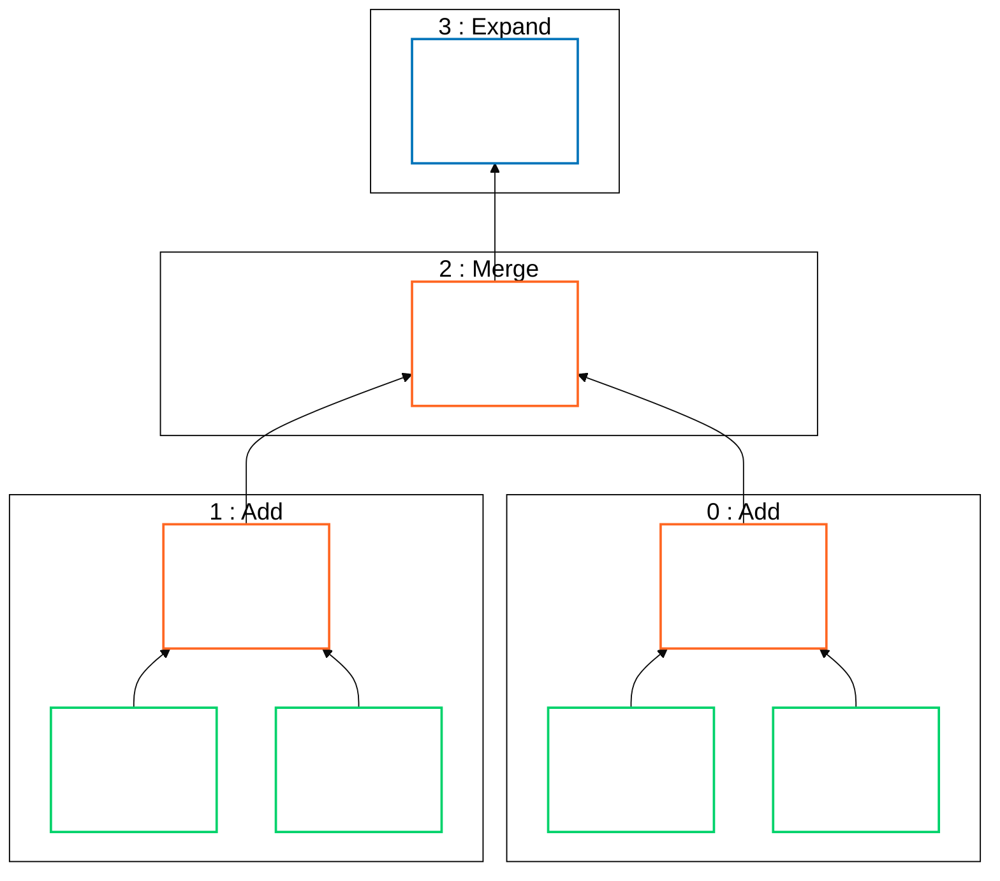

# Synthetic Tree Visualisation

Legend
- :green_square: Building Block
- :orange_square: Intermediate
- :blue_square: Final Molecule
- :red_square: Target Molecule

```mermaid
%%{init: {
    'theme': 'base',
    'themeVariables': {
        'backgroud': '#ffffff',
        'primaryColor': '#ffffff',
        'clusterBkg': '#ffffff',
        'clusterBorder': '#000000',
        'edgeLabelBackground':'#dbe1e1',
        'fontSize': '20px'
        }
    }
}%%
graph BT
classDef buildingblock stroke:#00d26a,stroke-width:2px
classDef intermediate stroke:#ff6723,stroke-width:2px
classDef final stroke:#0074ba,stroke-width:2px
classDef target stroke:#f8312f,stroke-width:2px
n0[<img src=""assets/acf5424b.svg"" height=75px/>]:::buildingblock
n1[<img src=""assets/33c587d5.svg"" height=75px/>]:::buildingblock
n2[<img src=""assets/a54ccd13.svg"" height=75px/>]:::intermediate
n3[<img src=""assets/bf44f44f.svg"" height=75px/>]:::buildingblock
n4[<img src=""assets/2f85b6cf.svg"" height=75px/>]:::buildingblock
n5[<img src=""assets/f69c33d1.svg"" height=75px/>]:::intermediate
n6[<img src=""assets/408f54d7.svg"" height=75px/>]:::intermediate
n7[<img src=""assets/a1906560.svg"" height=75px/>]:::final
subgraph " 0 : Add"
    n0 --> n2
    n1 --> n2
end
subgraph " 1 : Add"
    n3 --> n5
    n4 --> n5
end
subgraph " 2 : Merge"
    n5 --> n6
    n2 --> n6
end
subgraph " 3 : Expand"
    n6 --> n7
end
```
